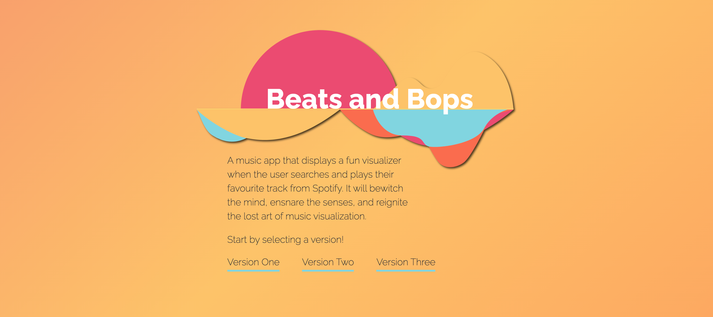
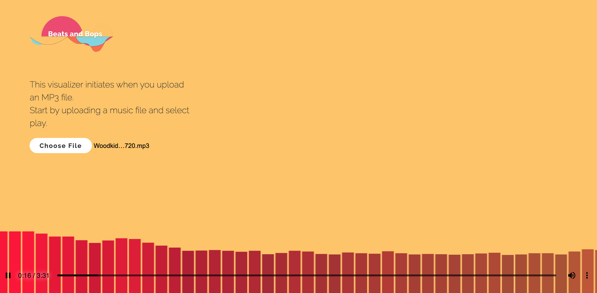

# Bootcamp Project # 1.00: Beats and Bops

**Date Created**: May 25th, 2021

**Group #**: 3.00

**Created By**: Lisa Le, Shannon Nell, Harmony Hood, Said Hadad, and Jaspreet Khela

**Description**: A music visualizer that syncs with music that is requested by the user and streamed from a server that contains the music (i.e. Soundcloud). There is also a spotify search bar for streaming audio.

***Usage:*** Currently in order to use the Spotify API, the user might need to go to [CORS Anywhere](https://cors-anywhere.herokuapp.com/corsdemo) and request temporary access to the demo server first. Then you can go and enter your song in the search bar. 

**Website**: [Beats and Bops](https://uotgroup3.github.io/beats-and-bops/)

**Project Document**: [Project Proposal](https://docs.google.com/document/d/1H5HEuLqtift8yredVhPvZUYwSanIB65mDYJWmKhV4tk/edit?usp=sharing)

**Logo**: 

**Screenshots**:
Homepage
Visualizer One
Visualizer Two
Visualizer Three

**APIs Used**: Spotify, Audio DB, Github, and Soundcloud

**Version One Third-Party Visualizer Source Repo**: https://github.com/prayash/nucleactor

**Tutorial for Version Two Visualizer**: https://www.youtube.com/watch?v=LJNiG8edBVY
